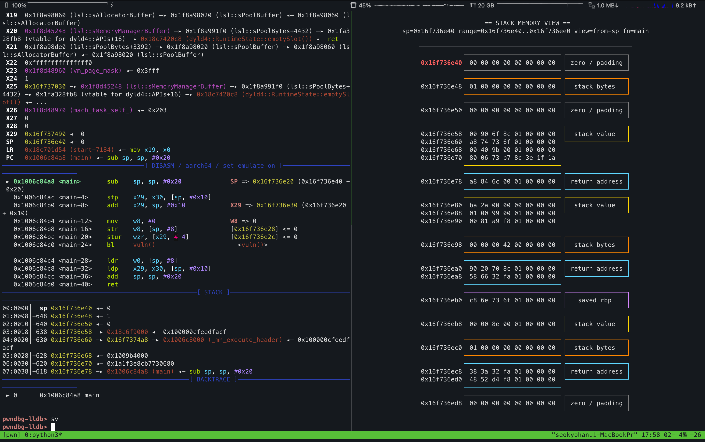

# DbgStackViewer

DbgStackViewer is a stack visualization helper for `gdb` and `lldb` that renders stack data in a dedicated `tmux` pane and works especially well with `pwndbg`.

It is designed to be beginner-friendly, so you can inspect stack data without digging through raw debugger output manually.

## Features

- Stack memory view with grouped regions and per-region colors
- Detail view centered around the current stack pointer (`sp`)
- Automatic pane sizing based on the current `tmux` layout
- Supports both `gdb` (including pwndbg) and `lldb`

## Installation

```bash
git clone https://github.com/seokjohn/dbgStackViewer
cd dbgStackViewer
```

### GDB

```bash
echo "source $(pwd)/dbginit.py" >> ~/.gdbinit
```

### LLDB

```bash
echo "command script import $(pwd)/dbginit.py" >> ~/.lldbinit
```
```bash
pwndbg-lldb> command source ~/.lldbinit
```
> [!NOTE]
> Known issue: automatic registration does not currently work in `pwndbg-lldb`, so manual command loading is required ([pwndbg issue #3178](https://github.com/pwndbg/pwndbg/issues/3178)).


## Commands

```bash
sv   # stack viewer
sd   # stack detail view (centered around sp)
```

## Requirements

- `tmux`
- Python 3
- `gdb` or `lldb`
